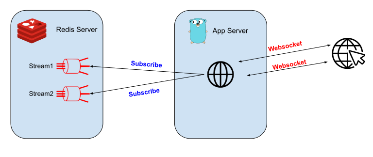

## Redis Streams to Websockets




Example code to show how a web browser can receive all updates on a [Redis Stream](https://redis.io/topics/streams-intro) via Websockets


### Using

In your web application add the following Javascript

```javascript
var conn = new WebSocket("ws://localhost:8080/ws?lastMod=0&Stream=<STREAM_NAME>");
conn.onclose = function(evt) {
	data.textContent = 'Connection closed';
}
conn.onmessage = function(evt) {
		RunMyDisplayFunction(evt.data);
}
```

The event data will be an array of JSON object mapping the the key/value pairs within the Redis stream message

```
$ redis-cli
127.0.0.1:6379> multi
OK
127.0.0.1:6379> xadd test_stream * name Neil instrument drums
QUEUED
127.0.0.1:6379> xadd test_stream * name Alex instrument guitar
QUEUED
127.0.0.1:6379> exec
1) "1639074721749-0"
2) "1639074721749-1"
```

Will send the following JSON update

```json
[{"name": "Neil", "instrument": "drums"},
{"name": "Alex", "instrument": "guitar"}]
```

### Testing / Example

Startup docker-compose

```
docker-compose up
```

Open a [web browser](http://localhost:8080/test)

Using Redis CLI add an entry to the test stream and watch the websocket test page update

```
$ for j in {1..10}; do
redis-cli xadd test_stream "*" key value${j} count $j time `date +%s.%N` user `whoami`
sleep 1
done
```
